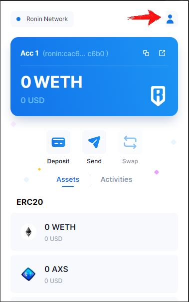
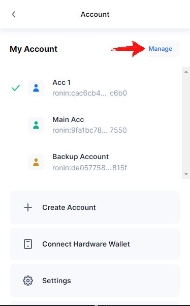
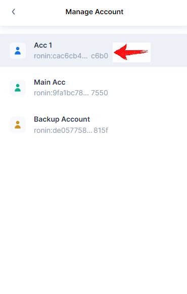
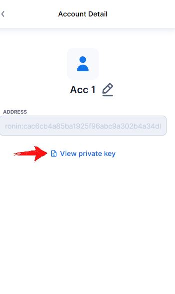

# F.A.Q.

## How do I get my private keys?

**Please keep these always safe and private!**

You will need to open your ronin wallet extension in Chrome or Firefox. And follow these steps:

## Is it safe to use?

What do you expect me to say? I'd say of course yes, but do not take me at my word.
Please do get your coder/progammer friends to read and check my code. Look for people who has used it already and ask them (hint: a lot are in the <a href="https://discord.gg/bmKvmhenvu">Discord</a>).

And if you still do not trust it, please do not use it.
I want you only using this tool/software if you are comfortable doing so.