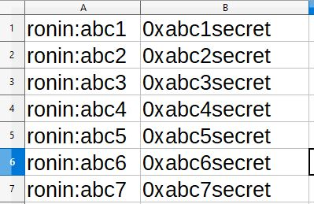

# Payments file format
It requires a JSON file like:

```
{
    "Manager": "ronin:<Manager address here>",
    "Scholars":[
        {
            "Name": "Scholar 1",
            "AccountAddress": "ronin:<account_address>",
            "ScholarPayoutAddress": "ronin:<scholar_address>",
            "ScholarPayout": 10,
            "TrainerPayoutAddress": "ronin:<trainer_address>",
            "TrainerPayout": 1,
            "ManagerPayout": 9
        },
        {...},
        ...
    ],
    "Donations": [
        {
            "Name": "Entity 1",
            "AccountAddress": "ronin:<donation_entity_address>",
            "Percent": 0.01
        },
        {
            ...
        }
    ]
}
```

Let's define the concepts in that file.
- **Manager**: There we input the "manager's" ronin address. This means all manager payments will be paid to that address. A manager is who owns the teams, who put the money to buy the axies the scholars are playing.
- **Scholars**: This is the list of all scholar accounts we need to make payments to each element in this list contains:
    - **Name**: Name of this account, it is only for identification purposes.
    - **Account Address**: Public ronin address of this scholar account. The account that is actually played and we need to get the SLP from
    - **Scholar Payout Address**: Scholar's ronin address. This is where we will pay the scholar. (Their private account)
    - **Scholar Payout**: This is the amount of SLP we will pay to the scholar
    - **Trainer Payout Address**: This is an optional parameter. It is the public ronin address of the trainer for this particular scholar account. A trainer is usually someone who helps the manager control and help him/her with the scholars.
    - **Trainer Payout**: If previous parameter is present, this is the amount of SLP it will be paid to that address.
    - **Manager Payout**: This is the amount of SLP that will be transferred to the manager account.
- **Donations**: Optional list of donations, in case you want to support other projects sharing with them part of your earnings. This percent will be calculated from the Manager Payout and rounded. **Donations to me do NOT go in this place, they are in the code itself!** If any donations or the fee does not reach a minumum of 1 SLP it will not be paid out.
    - **Name**: Name of the entity you want to donate to. This is only for identification purposes.
    - **Account Address**: Public ronin address of the entity or project you want to donate to.
    - **Percent**: Percent you want to donate to that entity. **Caution!** Be aware that to donate 1% you need to input: 0.01. If you write a 1, you would be donating 100% of your manager payments! Total percent of all donations added cannot be over 1 (100%). If that is the case, the software will throw an error and ask you to correct it.

Amounts in payots are exact SLP amounts, not percents. For that look into **payments percent file**.

**WARNING!** All addresses in the previous file are the PUBLIC ones. Remember to always keep your private keys safe.

# Payments Percent file format
It requires a JSON file like:

```
{
    "Manager": "ronin:<Manager address here>",
    "Scholars":[
        {
            "Name": "Scholar 1",
            "AccountAddress": "ronin:<account_address>",
            "ScholarPayoutAddress": "ronin:<scholar_address>",
            "ScholarPercent": 45,
            "TrainerPayoutAddress": "ronin:<trainer_address>",
            "TrainerPercent": 1
        },
        {
            "Name": "Scholar 1",
            "AccountAddress": "ronin:<account_address>",
            "ScholarPayoutAddress": "ronin:<scholar_address>",
            "ScholarPercent": 50,
            "ScholarPayout": 100,
            "TrainerPayoutAddress": "ronin:<trainer_address>",
            "TrainerPercent": 0,
            "TrainerPayout": 10
        },
        {...},
        ...
    ],
    "Donations": [
        {
            "Name": "Entity 1",
            "AccountAddress": "ronin:<donation_entity_address>",
            "Percent": 1
        },
        {
            ...
        }
    ]
}
```

Let's define the concepts in that file.
- **Manager**: There we input the "manager's" ronin address. This means all manager payments will be paid to that address. A manager is who owns the teams, who put the money to buy the axies the scholars are playing.
- **Scholars**: This is the list of all scholar accounts we need to make payments to each element in this list contains:
    - **Name**: Name of this account, it is only for identification purposes.
    - **Account Address**: Public ronin address of this scholar account. The account that is actually played and we need to get the SLP from
    - **Scholar Payout Address**: Scholar's ronin address. This is where we will pay the scholar. (Their private account)
    - **Scholar Percent**: This is the precent of SLP we will pay to the scholar. Percent is calculated from ALL the SLP in an account.
    - **Scholar Payout**: (Optional) If set, this will add extra amount of SLP on top of the percent defined in Scholar Percent.
    - **Trainer Payout Address**: (Optional) It is the public ronin address of the trainer for this particular scholar account. A trainer is usually someone who helps the manager control and help him/her with the scholars.
    - **Trainer Percent**: If previous parameter is present, this is the percent of SLP it will be paid to that address. It is required if Address for a trainer is present, but it can be 0 and pay with a fixed amount with the trainer payout field.
    - **Trainer Payout**: If Trainer Payour Address is present, this is the amount of SLP to be paid to that address. It is calculated on top of the trainer percent.
- **Donations**: Optional list of donations, in case you want to support other projects sharing with them part of your earnings. This percent will be calculated from the Manager Payout and rounded. **Donations to me do NOT go in this place, they are in the code itself!** If any donations or the fee does not reach a minumum of 1 SLP it will not be paid out.
    - **Name**: Name of the entity you want to donate to. This is only for identification purposes.
    - **Account Address**: Public ronin address of the entity or project you want to donate to.
    - **Percent**: Percent you want to donate to that entity. **Caution!** Be aware percents for this file are whole numbers, see explanation below.

Amounts in payouts are exact SLP amounts, percents are defined in whole numbers 1 -> 1%, 40 -> 40%, 100 -> 100%

**WARNING!** All addresses in the previous file are the PUBLIC ones. Remember to always keep your private keys safe.


# Secrets file format
This JSON file is much simpler, and you should never need to create it as you can use the secret generation command. But if you are curious, the format will be like:

```
{
    <AccountAddressRonin>:<PrivateKey>,
    ...
}
```

# Transfers file format
This JSON file defines the Axie transfers you wish to do. You define from which accounts you transfer which Axies to witch accounts. Here is an example:


```
    [
    {
        "AccountAddress": "ronin:<whohasanaxie>",
        "Transfers": [
            {
                "AxieId": 123,
                "ReceiverAddress": "<ronin:<whowillgetanaxie>"
            },
            {
                "AxieId": 123,
                "ReceiverAddress": "<ronin:<whowillgetanaxie>"
            },
            {
                "AxieId": 123,
                "ReceiverAddress": "<ronin:<whowillgetanaxie>"
            },
            {
                "AxieId": 123,
                "ReceiverAddress": "<ronin:<whowillgetanaxie>"
            }
            ...
        ]
    },
    {
        "AccountAddress": "ronin:<whohasanaxie>",
        "Transfers": [
            {
                "AxieId": 123,
                "ReceiverAddress": "<ronin:<whowillgetanaxie>"
            },
            {
                "AxieId": 123,
                "ReceiverAddress": "<ronin:<whowillgetanaxie>"
            },
            {
                "AxieId": 123,
                "ReceiverAddress": "<ronin:<whowillgetanaxie>"
            }
        ]
    },
    ...
    {
        "AccountAddress": "ronin:<whohasanaxie>",
        "Transfers": [
            {
                "AxieId": 123,
                "ReceiverAddress": "<ronin:<whowillgetanaxie>"
            },
            {
                "AxieId": 123,
                "ReceiverAddress": "<ronin:<whowillgetanaxie>"
            },
            {
                "AxieId": 123,
                "ReceiverAddress": "<ronin:<whowillgetanaxie>"
            }
        ]
    }
]

```

As you can see we put the account where we have the axies in `AccountAddress` and then inside `Transfers` we define the transfers we want to do from that account. In each we indicate the `AxieID` and the ronin `ReceiverAddress` to receive that Axie.


# Breeding file format

````

```


# Mass update CSV file
This CSV file is quite straight forward. You can use excel or google docs or anything that produces a csv file. To get these results, you will need to add your public ronin on the 1st column and your private key for that account on the 2nd column. The resulting format will be something that looks like:

```
ronin:abc1,0xsecretabc1
ronin:abc2,0xsecretabc2
ronin:abc3,0xsecretabc3
ronin:abc4,0xsecretabc4
```
In excel or google docs it looks something like:




All these will be merged with the pre-existing ones (if any) in secrets.json

If any other columns are present, they will simply be ignored. Furthermore, if headers are at the top of the columns, please remove them on the exported csv.

# Create Payments CSV file
This CSV file is used to create the percent payments file. You can use excel or google docs or anything that procudes a csv file. It has to look like something:


And the resulting csv:

```
Name,AccountAddress,ScholarPayoutAddress,ScholarPercent,ScholarPayout,TrainerPayoutAddress,TrainerPercent,TrainerPayout 
Test1,ronin:abc1,ronin:abc_scholar1,50,
Test2,ronin:abc2,ronin:abc_scholar2,50,
Test3,ronin:abc3,ronin:abc_scholar3,50,
Test4,ronin:abc4,ronin:abc_scholar4,50,
Test5,ronin:abc5,ronin:abc_scholar5,50,100
Test6,ronin:abc6,ronin:abc_scholar6,50,100,ronin:abc_trainer6,5
Test7,ronin:abc7,ronin:abc_scholar7,50,100,ronin:abc_trainer7,0,230
```

Please, this file cannot have any other headers other than the following.

- **Name**: This is only the name, is a for identification purposes
- **AccountAddress**: Account that is played and we will claim and payout from
- **ScholarPayoutAddress**: Account of the scholar to be paid to
- **ScholarPercent**: Percentaje to pay that scholar. Minimum of 40%
- **ScholarPayout**: (Optional) If present, will make sure that scholar gets additional SLP on top of the ScholarPercent
- **TrainerPayoutAddress**: (Optional) Account of the trainer to be paid to
- **TrainerPercent**: (Optional) Persentaje to pay to a trainer (it can be 0)
- **TrainerPayout**: (Optional) If present, will make sure that trainer gets additional SLP on top of the TrainerPercent.

**Note**: Percents in this file are written as whole numbers. For example, 40 means 40%, 5 means 5%.

# Create Breeding CSV file
This CSV file is used to create the breeding file. You can use excel or google docs or anything that produces a csv file. It has to look like something:


And the resulting csv:

```
Sire,Matron,AccountAddress
123,345,ronin:abc1
234,132,ronin:abc1
5677,879,ronin:abc1
789,787,ronin:abc1
```

Please, this file cannot have any other headers other than the following.
- **Sire**: AxieId of the Sire
- **Matron**: AxieId of the Matron
- **AccountAddress**: Account that holds both Axies

# Example Files

If after that you still unclear on how they look like. Please go to the folder sample_data to see sample files for how the payments file and the secrets file need to look like.
